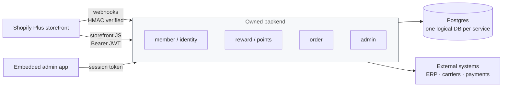

# Commerce Backend Microservices

Backend architecture case studies from commerce platforms built on Shopify Plus — where the storefront is hosted, but everything behind it (membership, rewards, ERP identity, fulfillment) is a service you own and operate.

These are write-ups, not source. Client code, credentials, and infrastructure identifiers are deliberately absent.

## Why this exists

Hosted commerce platforms handle catalog, cart, and checkout well. They stop being enough the moment a business needs rules the platform has no opinion about: a referral tree that decides who earns what, a legacy ERP that owns customer identity, a fulfillment flow that spans two carriers and three warehouses.

That gap is where these systems live. Each case below is one instance of it, with the constraints that shaped the design.

## Shape of the systems

Common decisions across all three systems:

| Decision | Rationale |
|---|---|
| One logical database per service, no cross-service reads | Service boundaries survive even when deployment is consolidated |
| Webhook idempotency by platform-supplied delivery ID | Commerce webhooks retry; at-least-once delivery is the contract |
| Outbox table for cross-service writes | A write and its downstream effect commit together or not at all |
| Own JWT for storefront auth, not platform app-proxy | Storefront needs identity the platform's customer model can't express |
| Money as integers, never floats | See [loyalty-ledger-systems](https://github.com/hak2881/loyalty-ledger-systems) for what happens otherwise |

## Cases

| # | Case | Domain | Core problem |
|---|---|---|---|
| 01 | [Referral reward backend](cases/01-referral-reward-backend.md) | US beauty-device brand — B2B + B2C on one store | Six service boundaries, one deployable, zero double-payouts |
| 02 | [Unified membership over a legacy ERP](cases/02-unified-membership-erp.md) | Korean outdoor gear retailer | The ERP owns customer identity; the storefront can't see it |
| 03 | [Global D2C fulfillment services](cases/03-global-d2c-fulfillment.md) | Korean dashcam manufacturer | One catalog, many countries, carrier-specific fulfillment |

## Stack

`Go` (chi · pgx · sqlc · goose) · `Python` (FastAPI · Django REST) · `PostgreSQL` · `Kubernetes` (EKS) · `Docker` · `AWS Lambda`

---

## 한국어 요약

Shopify Plus 위에 올린 커머스 플랫폼의 **백엔드 아키텍처 케이스 스터디** 모음입니다. 소스코드가 아니라 설계 기록이며, 클라이언트 코드·인증정보·인프라 식별자는 포함하지 않습니다.

호스팅형 커머스 플랫폼은 카탈로그·장바구니·결제까지는 충분하지만, 플랫폼이 관여하지 않는 규칙 — 누가 얼마를 적립받는지 결정하는 추천 트리, 고객 신원을 쥐고 있는 레거시 ERP, 두 개 택배사와 세 개 창고를 넘나드는 배송 흐름 — 이 필요해지는 순간부터는 직접 만든 백엔드가 필요합니다. 아래 세 건이 그 사례입니다.

**공통 설계 원칙**

- 서비스별 논리 DB 분리, 교차 조회 금지 — 배포를 합쳐도 경계는 유지
- 웹훅 멱등성은 플랫폼이 주는 전달 ID 기준 — 재전송은 예외가 아니라 계약
- 서비스 간 쓰기는 outbox 경유 — 쓰기와 후속 효과를 한 트랜잭션으로 묶음
- 스토어프론트 인증은 플랫폼 App Proxy가 아닌 자체 JWT — 플랫폼 고객 모델로 표현 못 하는 신원이 필요했음
- 금액은 정수로만 저장 (부동소수 금지)

| # | 케이스 | 도메인 | 핵심 문제 |
|---|---|---|---|
| 01 | 추천 보상 백엔드 | 미국 뷰티 디바이스 브랜드 (B2B·B2C 단일 스토어) | 서비스 경계 6개, 배포 1개, 중복 지급 0 |
| 02 | 레거시 ERP 위의 통합회원 | 국내 아웃도어 기어 리테일러 | ERP가 고객 신원을 쥐고 있고 스토어프론트는 그걸 볼 수 없음 |
| 03 | 글로벌 D2C 주문·배송 서비스 | 국내 대시캠 제조사 | 카탈로그 하나, 국가 다수, 택배사별 배송 처리 |
