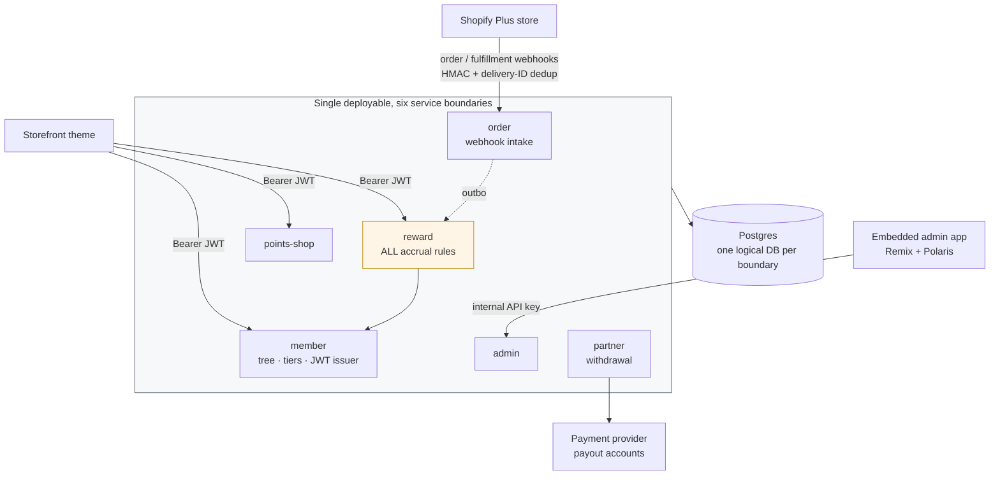

# Referral Reward Backend

**Domain** · US beauty-device brand, B2B and B2C served from a single Shopify Plus store
**Period** · 2026
**Scope** · Six backend service boundaries, embedded admin app, storefront auth

## Context

The brand sells through a distributor network. Members are recruited by other members, and that recruitment relationship is permanent — it decides who earns credit on every future order. On top of the member tree sits a separate class of Partner accounts, who can convert their earned credit into cash.

Commerce runs on one Shopify Plus store. B2B uses native company accounts, B2C uses the same store on a different domain. Everything about who-earns-what is outside the platform entirely.

## Problem

Three things made this harder than a points plugin.

**The reward rules were still moving.** Accrual had a tree component (buyer plus two uplines, each at their own tier rate), a retail QR component (single recipient, no tree propagation), and a partner component. Rates, eligibility, and even the number of ledgers changed several times during the build. Any design that scattered the calculation across services would have to be re-litigated on every change.

**Money that must never be wrong.** Credit is withdrawable as cash by partners. A rounding artifact isn't a display bug, it's a payout discrepancy. Points carry two decimal places, which is exactly the range where float arithmetic starts producing balances that don't reconcile.

**At-least-once everything.** Commerce webhooks retry. A retried fulfillment webhook that re-runs accrual pays three people twice.

## Architecture

**Accrual path.** A fulfillment webhook lands on `order`, which verifies HMAC and dedupes on the platform's delivery ID. `order` writes the order row and an outbox entry in one transaction. The outbox drains into `reward`, which is the only place that knows the rules: it resolves the buyer's position in the tree, walks up two levels, applies each recipient's own current tier rate, and appends entries to the credit ledger. Each ledger entry carries a unique idempotency key derived from the order and the recipient, so a replay is a no-op at the database level rather than a race the application has to win.

**Auth.** Storefront screens needed member identity that the platform's customer model couldn't express — tree position, tier, partner flag. Rather than route through the platform's app proxy, `member` became the auth issuer: email/password login returning a signed JWT, verified by every service through shared middleware. Platform customers remain as side records for order attribution only.

## Key decisions

**Reward calculation lives in exactly one service.** No rate, no eligibility rule, no tier threshold is hardcoded anywhere but `reward`. This was the single decision that made the shifting policy survivable — when the rules changed, one service changed. The alternative, letting `order` or `partner` apply "their" portion, would have spread every policy revision across four codebases.

**One ledger, permission-based withdrawal.** The system started with two ledgers: store credit and cashable points. The split encoded a *policy* distinction (who may cash out) in the *data model*, which meant every rule change forced a data migration and every balance query had to union two tables. It collapsed into a single `credit_ledger`, with withdrawal eligibility read from the partner flag instead. Cash-out capability is an authorization question, not a storage question.

**Integers all the way down.** Money is stored as `int64` cents; points as `int64` at hundredths — `3.33 pt` persists as `333` and is formatted for display only at the edge. Nothing in the accrual path touches a float.

**Six boundaries, one deployable.** The system was designed as six services and initially deployed that way. It was later consolidated into a single binary while keeping the boundaries intact — separate packages, separate logical databases, no cross-database reads, internal calls still going over HTTP with an API key. Traffic never justified six pods and six sets of connection pools; the boundaries were worth keeping, the operational overhead wasn't. Splitting them back out is a deployment change, not a rewrite.

**An API gateway that was removed.** The original design had a gateway service fronting the others. Once storefront auth moved to per-service JWT verification, the gateway was doing nothing but adding a hop and a failure mode. It was deleted.

## Stack

| Layer | Choice |
|---|---|
| Services | Go 1.26, chi v5, pgx/v5, sqlc (generated queries), goose (migrations), slog |
| Layout | `go.work` workspace, one `go.mod` per service, `shared/` limited to money, webhook HMAC, middleware |
| Data | RDS PostgreSQL, one logical database per service boundary |
| Admin | Remix + Polaris, embedded in the platform admin |
| Runtime | Kubernetes on EKS, container port unified at 8000, `/health` probe |

## Outcome

- Six service boundaries preserved through a consolidation from six deployments to one, with no change to service code — only composition and routing
- Two parallel ledgers merged into one, with historical balances migrated; withdrawal eligibility reduced to a permission check
- Gateway service and platform app-proxy authentication both retired after the JWT model landed, removing two hops from the storefront request path
- Accrual is idempotent at three layers: webhook delivery ID, ledger idempotency key, and outbox drain

## What I would revisit

The outbox drain is polled. At this order volume, polling is fine and the failure behavior is easy to reason about, but it puts a floor on accrual latency that a listener-based drain wouldn't. Worth changing only if accrual ever needs to be visible to the customer in real time — it currently isn't, since accrual fires at fulfillment rather than at checkout.

---

## 한국어 요약

미국 뷰티 디바이스 브랜드의 **추천 보상 백엔드**. 회원이 회원을 모집하고, 그 관계가 영구적으로 유지되며 이후 모든 주문의 적립 대상을 결정합니다. 그 위에 현금 인출이 가능한 Partner 등급이 따로 있습니다. 커머스는 Shopify Plus 단일 스토어(B2B는 네이티브 컴퍼니 계정, B2C는 같은 스토어 다른 도메인)를 쓰지만, 적립 규칙은 전부 플랫폼 바깥입니다.

**어려웠던 지점**

1. **보상 규칙이 계속 바뀌었습니다.** 트리 적립(본인 + 업라인 2단, 각자 자기 등급률), Retail QR 적립(트리 확산 없이 1명), Partner 적립이 각각 따로 있었고 요율·대상·심지어 원장 개수까지 여러 번 변경됐습니다.
2. **틀리면 안 되는 돈.** 크레딧은 Partner가 현금으로 인출합니다. 반올림 오차는 표시 버그가 아니라 지급 차액입니다. 포인트가 소수점 2자리라 float를 쓰면 정확히 잔액이 안 맞는 구간이 생깁니다.
3. **모든 것이 at-least-once.** 웹훅은 재전송됩니다. 재전송된 배송 웹훅이 적립을 다시 돌리면 3명에게 두 번 지급됩니다.

**핵심 결정**

- **보상 계산은 `reward` 서비스에만 존재합니다.** 요율·조건·등급 기준을 다른 어디에도 하드코딩하지 않았습니다. 정책이 흔들려도 고칠 곳이 한 군데라는 것 — 이 결정 하나가 잦은 정책 변경을 견디게 했습니다.
- **원장 1개 + 권한 기반 인출.** 처음엔 스토어 크레딧 / 현금화 포인트 2개 원장이었습니다. 이건 "누가 현금화할 수 있는가"라는 **정책** 구분을 **데이터 모델**에 새긴 것이라, 규칙이 바뀔 때마다 데이터 이관이 필요했고 잔액 조회는 매번 두 테이블을 합쳐야 했습니다. 단일 `credit_ledger`로 통합하고 인출 가능 여부는 파트너 권한으로만 판단하도록 바꿨습니다. 현금화는 저장 문제가 아니라 인가 문제입니다.
- **전부 정수로.** 금액은 센트 `int64`, 포인트는 ×100 `int64` (3.33pt → 333). 표시할 때만 변환하고, 적립 경로에서 float를 쓰지 않습니다.
- **경계 6개, 배포 1개.** 6개 서비스로 설계·배포했다가 이후 단일 바이너리로 합쳤습니다. 단 패키지 분리·논리 DB 분리·교차 조회 금지·내부 API Key 호출은 그대로 유지했습니다. 트래픽이 파드 6개와 커넥션 풀 6벌을 정당화하지 못했을 뿐, 경계 자체는 지킬 값어치가 있었습니다. 다시 쪼개는 건 재작성이 아니라 배포 변경입니다.
- **게이트웨이는 삭제했습니다.** 스토어프론트 인증이 서비스별 JWT 검증으로 옮겨간 뒤로 게이트웨이는 홉 하나와 장애 지점 하나만 추가하고 있었습니다.

**결과**

- 배포를 6개 → 1개로 합치면서 서비스 코드 변경 없이 경계 6개를 그대로 유지 (조립·라우팅만 변경)
- 원장 2개를 1개로 통합하고 과거 잔액 이관, 인출 자격은 권한 체크로 축소
- JWT 도입 후 게이트웨이와 App Proxy 인증을 모두 제거해 스토어프론트 요청 경로에서 홉 2개 삭제
- 적립 멱등성을 3중으로 확보: 웹훅 전달 ID · 원장 idem_key · outbox 드레인

**다시 한다면** — outbox 드레인이 폴링 방식입니다. 현재 주문량에서는 문제없고 장애 동작도 단순하지만 적립 지연에 하한이 생깁니다. 적립이 고객에게 실시간으로 보여야 할 때만 바꿀 가치가 있고, 지금은 결제가 아니라 배송 시점에 적립되므로 해당되지 않습니다.
