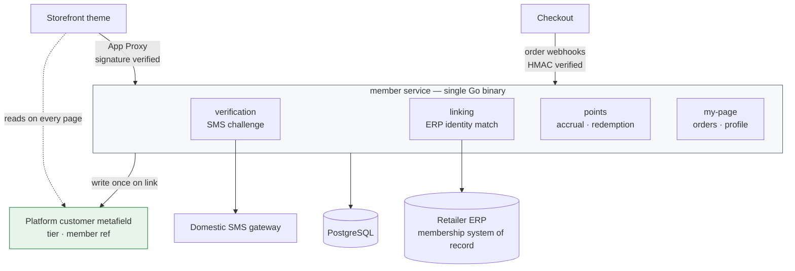

# Unified Membership Over a Legacy ERP

**Domain** · Korean outdoor gear retailer, offline stores plus a new online storefront
**Period** · 2026
**Scope** · Identity resolution, my-page, point accrual and redemption at checkout

## Context

The retailer had a membership program long before it had an online store. Members, their tiers, and their accumulated standing lived in an ERP that predates the storefront and will outlive it.

When the online store launched, a returning customer of fifteen years arrived as a brand-new platform customer with zero points. The two systems had no idea they were describing the same person.

## Problem

**Identity is owned elsewhere.** The ERP is the system of record for membership. The commerce platform is the system of record for orders. Neither can be told to defer to the other — the ERP is used by store staff who will never touch the commerce admin, and the platform can't be asked to model a membership scheme it doesn't have primitives for.

The only reliable join key between them was a phone number, which means the link cannot be established without proving the customer actually holds that phone.

**Points must be spendable at checkout.** A balance that can only be viewed is a feature nobody uses. Redemption has to happen inside a checkout flow the platform controls, and the balance has to be correct at the moment of purchase — not eventually consistent with it.

**The storefront reads this constantly.** Tier badge, point balance, member-only pricing — these render on nearly every page. A design where each render costs an ERP round-trip fails on the first traffic spike.

## Architecture

**Linking flow.** The customer enters a phone number, receives an SMS challenge, and enters the code. On success the service queries the ERP for a membership record matching that number. If one exists, the platform customer and the ERP member are linked, and the resulting tier and member reference are written back to the platform customer as metafields.

That last step is the one that makes the rest cheap. The theme reads tier off the customer object it already has in its rendering context — no request to my service, no request to the ERP. The metafield is a projection, refreshed when the underlying facts change, never treated as the source of truth.

**Point flow.** Accrual is driven by order webhooks. Redemption happens in the checkout flow, where the service is asked to reserve and then confirm a deduction against the order.

## Key decisions

**One service, and new features become packages inside it.** This system was built on the same Go boilerplate as [case 01](01-referral-reward-backend.md) and made the opposite deployment call: a single service, with every new capability landing as a package rather than a new deployable. Splitting was explicitly deferred until scale demands it.

The reason is that case 01 had genuinely independent concerns — reward calculation, withdrawal, and the points shop have different change rates and different failure blast radii. Here, verification, linking, points, and my-page are all facets of one thing: this customer's membership. Cutting between them would have produced services that always deploy together and always fail together, which is the cost of microservices without the benefit.

**The metafield is a cache, and it is treated like one.** Writing tier into the platform's customer object is the difference between a storefront that renders member state for free and one that makes a network call per page. The discipline is that nothing *decides* anything from the metafield — accrual, redemption, and eligibility all read the service's own database. The metafield only renders.

**App proxy signatures here, not a custom JWT.** Case 01 issued its own tokens because member identity had structure — tree position, partner status — that the platform's customer model couldn't hold. Here, the platform customer *is* the identity once linked; there was nothing left to express. Verifying the platform's app-proxy signature meant no password storage, no session management, and no second login for the customer.

**Phone verification is not optional, even though it costs conversions.** The link grants access to another person's purchase history and point balance if it's wrong. An unverified phone match is a straightforward account-takeover path. The SMS challenge stays.

**OpenAPI as the contract, served from the service.** The theme, the checkout extension, and the ERP integration were built by different people at different times. The spec is committed alongside the code and served from the running service, so the contract and the implementation can't drift silently.

## Stack

| Layer | Choice |
|---|---|
| Service | Go, chi, pgx, sqlc, goose |
| Layout | `go.work` workspace; `shared/` holds middleware (CORS, API key, logging), webhook HMAC and app-proxy signature verification, API docs |
| Data | PostgreSQL |
| External | Retailer ERP (REST), domestic SMS gateway, commerce platform Admin API |
| Runtime | Kubernetes, shared ALB ingress, `/health` probe |
| Contract | OpenAPI spec committed in-repo and served at `/docs` |

## Outcome

- Returning offline customers arrive online with their tier and point balance intact, established through a verified phone challenge rather than self-declaration
- Points are redeemable inside checkout, not merely visible on a my-page
- Per-page member state renders from a platform metafield, keeping the storefront's hot path free of calls to the service or the ERP
- New capabilities (my-page orders, profile, checkout points) shipped as packages in one service — no new deployment, no new database, no new ingress rule per feature

---

## 한국어 요약

**레거시 ERP가 고객 신원을 쥐고 있는 상황에서의 통합회원 연동.** 국내 아웃도어 기어 리테일러입니다. 온라인 스토어보다 오프라인 멤버십이 훨씬 먼저 있었고, 회원과 등급, 포인트 잔액은 전부 ERP에 들어 있습니다. 그 ERP는 스토어보다 오래됐고 아마 더 오래 남을 겁니다.

온라인 스토어를 열자 15년 단골이 포인트 0인 신규 고객으로 들어왔습니다. 두 시스템은 그게 같은 사람인 줄 몰랐습니다.

**어려웠던 지점**

- **신원의 주인이 밖에 있습니다.** 멤버십의 원본은 ERP, 주문의 원본은 커머스 플랫폼입니다. 어느 쪽에도 상대에게 양보하라고 할 수 없습니다. ERP는 커머스 어드민을 평생 열어볼 일 없는 매장 직원들이 쓰고, 플랫폼에는 이 멤버십 체계를 담을 기본 자료구조가 없습니다. 둘을 잇는 키 중에 믿을 만한 건 전화번호뿐이었는데, 그러면 본인이 그 번호를 실제로 쓰고 있다는 걸 확인하기 전에는 연결할 수가 없습니다.
- **포인트는 결제에서 써져야 합니다.** 조회만 되는 잔액은 아무도 안 씁니다. 차감은 플랫폼이 관장하는 체크아웃 안에서 일어나야 하고, 잔액은 결제하는 그 순간에 맞아야 합니다. 나중에 맞춰지는 걸로는 부족합니다.
- **스토어프론트가 이걸 끊임없이 읽습니다.** 등급 뱃지, 포인트 잔액, 회원가가 거의 모든 페이지에 나옵니다. 페이지를 그릴 때마다 ERP를 왕복하는 설계는 트래픽이 처음 몰리는 날 무너집니다.

**핵심 결정**

- **서비스는 하나, 새 기능은 그 안의 패키지로.** [케이스 01](01-referral-reward-backend.md)과 같은 Go 보일러플레이트를 쓰면서 배포 결정은 정반대로 갔습니다. 01은 보상 계산과 인출, 포인트샵이 변경 주기도 장애 반경도 실제로 달랐습니다. 여기서는 인증, 연동, 포인트, 마이페이지가 전부 "이 고객의 멤버십"이라는 한 가지의 다른 면일 뿐입니다. 굳이 쪼갰다면 항상 같이 배포되고 항상 같이 죽는 서비스들이 나왔을 겁니다. 마이크로서비스의 비용만 치르고 이득은 못 챙기는 형태죠.
- **메타필드는 캐시이고, 캐시로 다룹니다.** 등급을 플랫폼 고객 객체에 써두면 스토어프론트는 회원 상태를 공짜로 그립니다. 지킨 규칙은 하나입니다. **메타필드로는 아무것도 판단하지 않습니다.** 적립과 차감, 자격 판정은 전부 서비스 자체 DB를 읽고, 메타필드는 표시에만 씁니다.
- **여기선 자체 JWT가 아니라 App Proxy 서명.** 01은 트리 위치나 파트너 여부처럼 플랫폼 고객 모델에 안 들어가는 구조가 있어서 토큰을 직접 발급했습니다. 여기서는 연결이 끝난 순간 플랫폼 고객이 곧 신원이라, 따로 표현할 게 남지 않았습니다. App Proxy 서명 검증으로 가면서 비밀번호 저장도, 세션 관리도, 고객의 2차 로그인도 없앴습니다.
- **문자 인증은 전환율을 깎아도 뺄 수 없습니다.** 잘못 연결되면 남의 구매 이력과 포인트에 접근하게 됩니다. 인증 없이 번호만 맞춰보는 건 그대로 계정 탈취 경로입니다.
- **계약은 OpenAPI로.** 테마와 체크아웃 익스텐션, ERP 연동을 서로 다른 사람이 다른 시점에 붙였습니다. 스펙을 코드와 함께 커밋하고 돌아가는 서비스가 직접 서빙하게 해서, 계약과 구현이 모르는 사이에 어긋나지 않도록 했습니다.

**결과**

- 오프라인 단골이 온라인에서 등급과 포인트를 그대로 갖고 시작 (자기 신고가 아니라 인증된 문자 챌린지 기반)
- 포인트가 마이페이지 조회용에 그치지 않고 체크아웃에서 실제로 차감
- 페이지마다 필요한 회원 상태는 플랫폼 메타필드에서 렌더, 스토어프론트 핫패스에는 서비스나 ERP 호출이 없음
- 마이페이지 주문, 프로필, 체크아웃 포인트를 한 서비스의 패키지로 추가. 기능마다 새 배포나 새 DB, 새 ingress 규칙을 만들지 않음
