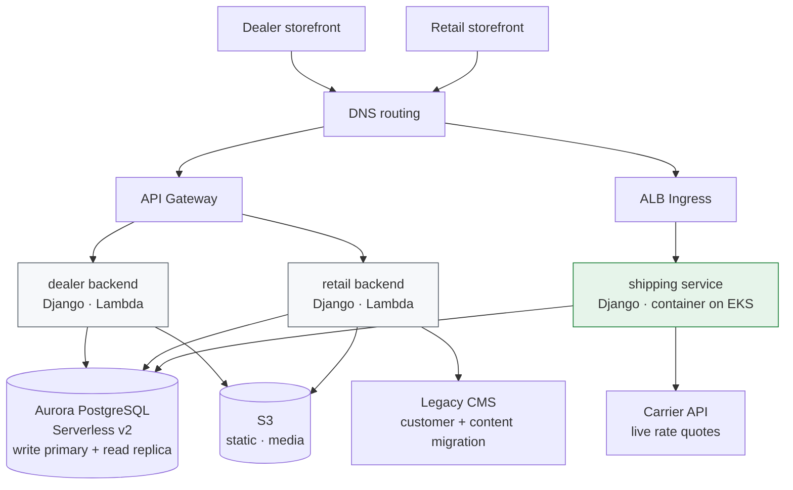

# Global D2C Backends: Two Storefronts, Three Services, Two Runtimes

**Domain** · Korean dashcam manufacturer selling worldwide — B2B dealer channel and B2C direct
**Period** · 2025–2026
**Scope** · Three backend services, legacy CMS migration, international shipping rates, handover

## Context

A hardware manufacturer with a global dealer network and a growing direct-to-consumer business. Two storefronts on the same commerce platform: one for dealers, one for retail. Behind them, three backend services that had accumulated over time — and, on the retail side, a WordPress site that had been the storefront before the migration and still held the customer records.

I took this over mid-life, extended it, and eventually packaged the whole thing for handover to the client's own team.

## Problem

**Two channels, one product catalog, different everything else.** Dealers and consumers share products but not pricing, not registration, not fulfillment. They ended up as separate storefronts with separate backends — which is defensible, but it means every shared concern (catalog sync, the platform API client, upload handling) exists twice and can drift.

**International shipping rates are not a lookup table.** Rates depend on destination, weight, dimensions, and the carrier's own live pricing. They have to be quoted before the customer commits, which puts a third-party API on the critical path of the purchase flow.

**A legacy CMS still owned the customers.** The retail side had years of WordPress accounts and content. Migration wasn't a one-shot script — the two systems had to coexist while records moved.

**Long-running jobs and request handling shared a runtime.** The retail backend ran catalog and customer sync alongside its API, on the same serverless function.

## Architecture

Two compute models on purpose:

| | Dealer + retail backends | Shipping service |
|---|---|---|
| Runtime | Lambda via Zappa | Container on Kubernetes |
| Traffic shape | Spiky, mostly idle | Steady, on the purchase path |
| Why | Scale-to-zero matters more than warm latency | Cold starts on a checkout-blocking call don't |
| Arch | x86_64 | arm64 |

## Key decisions

**The shipping service does not run on Lambda.** Everything else does. Rate quotes sit in the middle of the purchase flow — the customer is waiting, and a cold start plus a carrier round-trip is a visible stall at the worst possible moment. It runs as a persistently warm container behind an ALB with a fixed worker count instead. The other two services are mostly idle between dealer logins and admin actions, where scale-to-zero is worth more than warm latency.

This is the general principle: pick the runtime per workload's latency sensitivity, not per organization's standard.

**Read/write splitting at the ORM router, not in application code.** Both Django services route writes to the primary and reads to the replica through a database router. No view, serializer, or task has to remember which connection to use, and no future contributor can forget.

**Aurora Serverless for a workload that is genuinely bursty.** Global D2C traffic follows time zones and product launches. A provisioned instance sized for the peak is idle most of the day; sized for the median it falls over on launch day.

**camelCase at the API boundary, snake_case inside.** The services are consumed by storefront JavaScript. Rather than have every frontend consumer transform keys — or have Python code adopt JS conventions — the translation happens once, in a serializer layer at the edge. Each side of the boundary reads naturally in its own language.

**The retail backend's 900-second timeout is a compromise I would not repeat.** Its sync jobs — catalog reconciliation and legacy customer migration — run in the same function as its API, which forced a function-wide timeout thirty times longer than the API needs. It works, and it kept the deployment surface small during migration. But it means a runaway sync consumes the same concurrency pool that serves requests, and it makes the timeout useless as a guardrail on the API path. Those jobs belong on their own schedule-triggered function or a queue worker.

**Handover was treated as a deliverable, not an afterthought.** The client's team had to be able to run this without me. That meant infrastructure architecture and database schema written down, every AWS identifier replaced by a placeholder resolved from a separately delivered secrets sheet, source bundles with published checksums, and an environment variable reference. Documentation with account IDs and RDS endpoints baked in is documentation you can't hand to anyone.

## Stack

| Layer | Choice |
|---|---|
| Services | Python 3.10/3.12, Django 4.2, Django REST Framework |
| API | camelCase serialization, drf-spectacular (OpenAPI + Swagger UI) |
| Data | Aurora PostgreSQL Serverless v2, read/write router, `aws-psycopg2` |
| Serverless | Zappa → Lambda → API Gateway |
| Container | Docker `linux/arm64` → ECR → EKS, Gunicorn behind ALB |
| Storage | S3 via django-storages |
| External | Commerce platform Admin API, carrier rate API, legacy WordPress, support desk, SMTP |

## Outcome

- Three services consolidated onto one documented infrastructure model, with the runtime choice per service justified by its traffic shape rather than inherited
- Live carrier rate quoting on the retail purchase path, served from a warm container rather than a cold function
- Legacy CMS customers and content migrated onto the commerce platform with both systems live during the transition
- Complete handover package: infrastructure architecture, database schema, environment variable reference, and checksummed source bundles — with every account-specific identifier parameterized

---

## 한국어 요약

국내 대시캠 제조사의 **글로벌 D2C 백엔드**. 딜러 채널과 소비자 채널 두 개의 스토어프론트, 그 뒤에 시간을 두고 쌓인 백엔드 3개, 그리고 소비자 채널에는 이전 스토어프론트였고 여전히 고객 데이터를 갖고 있던 WordPress가 남아 있었습니다. 중간에 인수받아 확장했고, 최종적으로 고객사 팀에 인계할 수 있게 패키징했습니다.

**어려웠던 지점**

- **채널 둘, 카탈로그 하나, 나머지는 전부 다름.** 딜러와 소비자는 상품은 공유하지만 가격·등록·배송이 다릅니다. 스토어프론트와 백엔드를 나눈 건 타당하지만, 공통 관심사(카탈로그 싱크, 플랫폼 API 클라이언트, 업로드)가 두 벌 존재하고 어긋날 수 있다는 뜻이기도 합니다.
- **국제 배송비는 조회 테이블이 아닙니다.** 목적지·중량·부피·택배사 실시간 요금에 따라 달라지고, 고객이 결제를 확정하기 **전에** 견적이 나와야 합니다. 즉 서드파티 API가 구매 경로의 임계 경로에 들어옵니다.
- **레거시 CMS가 여전히 고객을 갖고 있었습니다.** 일회성 스크립트로 끝나지 않고, 이관 기간 동안 두 시스템이 공존해야 했습니다.
- **장기 실행 작업과 요청 처리가 런타임을 공유**하고 있었습니다.

**핵심 결정**

- **배송 서비스만 Lambda에 올리지 않았습니다.** 요금 견적은 구매 흐름 한가운데 있습니다 — 고객이 기다리는 중이고, 콜드 스타트 + 택배사 왕복은 하필 가장 나쁜 타이밍의 멈춤입니다. 그래서 ALB 뒤 상시 워밍된 컨테이너로 돌립니다. 나머지 둘은 딜러 로그인과 관리 작업 사이에 대부분 유휴 상태라 콜드 스타트보다 scale-to-zero가 이득입니다. **런타임은 조직 표준이 아니라 워크로드의 지연 민감도로 고른다** — 이게 원칙입니다.
- **읽기/쓰기 분리는 애플리케이션 코드가 아니라 ORM 라우터에서.** 뷰·시리얼라이저·태스크 어디서도 어느 커넥션인지 기억할 필요가 없고, 나중에 들어온 사람이 잊을 수도 없습니다.
- **진짜로 버스티한 워크로드에 Aurora Serverless.** 글로벌 D2C 트래픽은 시간대와 신제품 출시를 따라갑니다. 피크에 맞춘 인스턴스는 하루 대부분 놀고, 중앙값에 맞추면 출시일에 넘어집니다.
- **경계에서는 camelCase, 안에서는 snake_case.** 변환을 엣지의 시리얼라이저 한 곳에서만 합니다. 경계 양쪽이 각자의 언어에서 자연스럽게 읽힙니다.
- **소비자 백엔드의 900초 타임아웃은 다시 하지 않을 타협입니다.** 카탈로그 정합·레거시 고객 이관 작업이 API와 같은 함수에서 돌아서, API에 필요한 값의 30배짜리 타임아웃을 함수 전체에 걸어야 했습니다. 동작하고 이관 기간 배포 표면을 작게 유지해주긴 했지만, 폭주한 싱크가 요청을 처리하는 동시성 풀을 그대로 잡아먹고 타임아웃이 API 경로의 안전장치 역할을 못 하게 됩니다. 이 작업들은 스케줄 트리거 함수나 큐 워커로 빠져야 합니다.
- **인계를 결과물로 취급했습니다.** 인프라 아키텍처와 DB 스키마를 문서화하고, **모든 AWS 식별자(계정 ID·RDS 엔드포인트·ACM ARN·VPC/서브넷·ECR URI)를 placeholder로 치환**해 별도 시트로 분리했으며, 체크섬을 붙인 소스 번들과 환경변수 레퍼런스를 함께 전달했습니다. 계정 ID가 박힌 문서는 누구에게도 건넬 수 없는 문서입니다.

**결과**

- 서비스 3개를 문서화된 하나의 인프라 모델로 정리 (런타임 선택 근거를 트래픽 형태로 명시)
- 소비자 구매 경로에 실시간 택배사 요금 견적 — 콜드 함수가 아닌 워밍된 컨테이너에서 서빙
- 레거시 CMS 고객·콘텐츠를 무중단 공존 상태로 커머스 플랫폼에 이관
- 인프라 아키텍처·DB 스키마·환경변수 레퍼런스·체크섬 소스 번들로 구성된 인계 패키지 완성 (계정 종속 식별자 전부 파라미터화)
